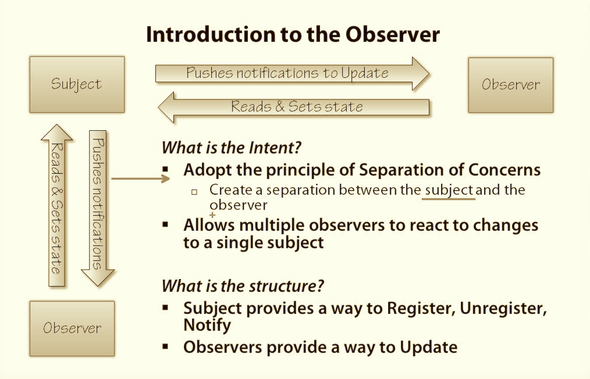

<h2>When to use Observers?</h2>
<ul>
<li>When one object is dependent on another object</li>
<li>When the change on one object requires a change to many other objects</li>
<li>When changes on an object should be notified to other objects without thier knowledge or interfere</li>
</ul>

